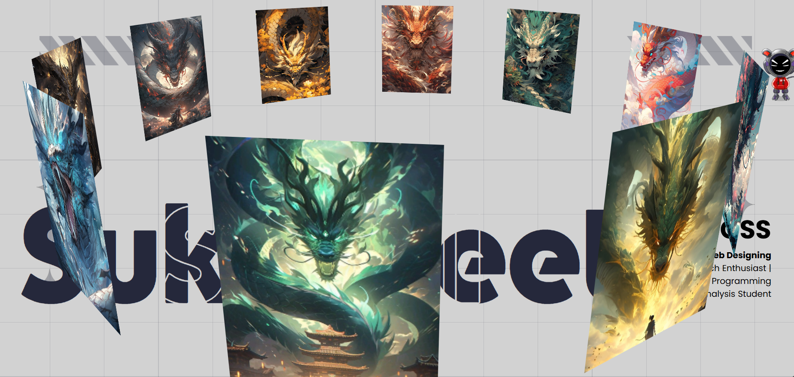
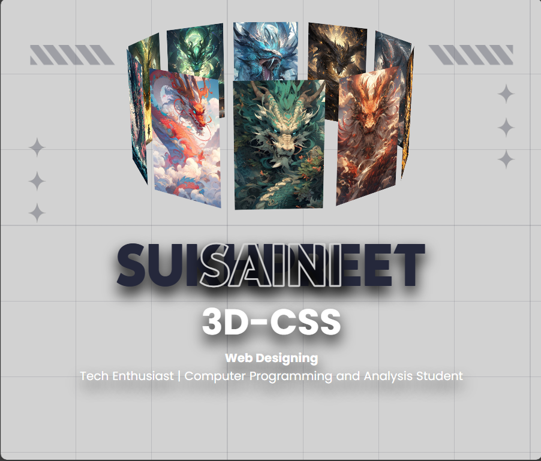

# 🌟 3D CSS Banner Project 🌟

Welcome to the 3D CSS Banner Project! This project showcases an immersive 3D banner created using CSS animations and transformations. The design is fully responsive and adapts to different screen sizes beautifully. Dive into the code and explore the magic of CSS!

## 🚀 Features

- **3D Animation**: A rotating 3D slider that adds depth and dynamism to your webpage.
- **Responsive Design**: Optimized for all screen sizes, ensuring a seamless experience on any device.
- **Custom Fonts**: Incorporates stylish fonts from [ICA Rubrik](https://fonts.cdnfonts.com/css/ica-rubrik-black) and [Poppins](https://fonts.cdnfonts.com/css/poppins).
- **Clean Layout**: A modern, clean layout with a visually appealing background.

## 📸 Screenshots

### Desktop View


### Mobile View


## 🛠️ Installation

1. Clone this repository:
   ```bash
   git clone https://github.com/SUKH2022/3D-img_slide.git
   ```

2. Navigate to the project directory:
    ```bash
    cd 3D-img_slide
    ```

3. Open index.html in your browser to see the magic!

## 📄 Code Overview

### HTML Structure

The core structure of the banner is encapsulated in the div elements, defining the slider and its items.

```bash
<div class="banner">
    <div class="slider" style="--quantity: 10">
        <div class="item" style="--position: 1"></div>
        <div class="item" style="--position: 2"></div>
        <div class="item" style="--position: 3"></div>
        <div class="item" style="--position: 4"></div>
        <div class="item" style="--position: 5"></div>
        <div class="item" style="--position: 6"></div>
        <div class="item" style="--position: 7"></div>
        <div class="item" style="--position: 8"></div>
        <div class="item" style="--position: 9"></div>
        <div class="item" style="--position: 10"></div>
    </div>
    <div class="content">
        <h1 data-content="SAINI">Sukhpreet</h1>
        <div class="author">
            <h2>3D-CSS</h2>
            <p><b>Web Designing</b></p>
            <p>Tech Enthusiast | Computer Programming and Analysis Student</p>
        </div>
        <div class="model"></div>
    </div>
</div>
```

## CSS Magic

The CSS handles the 3D transformations, animations, and responsive design adjustments.

```bash
@keyframes autoRun {
    from {
        transform: perspective(1000px) rotateX(-16deg) rotateY(0deg);
    }
    to {
        transform: perspective(1000px) rotateX(-16deg) rotateY(360deg);
    }
}

.banner .slider .item {
    transform: rotateY(calc((var(--position) - 1) * (360 / var(--quantity)) * 1deg)) translateZ(550px);
}

@media screen and (max-width: 1023px) {
    .banner .slider {
        width: 160px;
        height: 200px;
        left: calc(50% - 80px);
    }
    .banner .content h1 {
        font-size: 7em;
    }
}
```

## 👨‍💻 Author

### Sukhpreet Saini
Tech Enthusiast | Computer Programming and Analysis Student

Follow me on [GitHub](https://github.com/SUKH2022) for more exciting projects!
